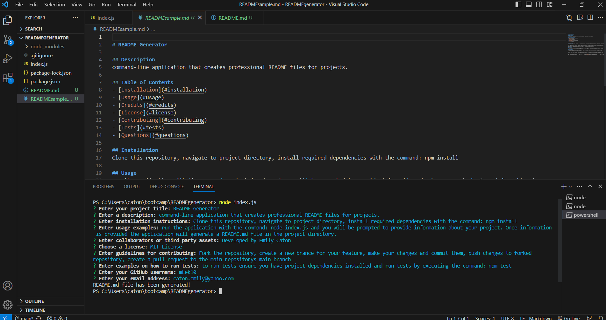

# Professional README Generator

## Description
The Professional README Generator is a command-line application that allows developers to quickly create high-quality and professional README files for their projects. It prompts the user for various pieces of information about their project and generates a README file with the appropriate sections and formatting.

## Installation
To use the Professional README Generator, follow these steps:

1. Clone this repository to your local machine.
2. Navigate to the project directory.
3. Install the required dependencies by running the following command: npm install

## Usage
1. After installing the dependencies, run the application using the following command: node index.js
2. You will be prompted to provide information about your project, including the project title, description, installation instructions, usage examples, collaborators or third-party assets, chosen license, contributing guidelines, test examples, GitHub username, and email address.
3. Once you've provided all the necessary information, the application will generate a README.md file in the project directory.

## Credits
This project was developed by [Emily Caton](https://github.com/mLek10).

## Contributing
Contributions to this project are welcome! To contribute, follow these steps:

1. Fork the repository.
2. Create a new branch for your feature or bug fix.
3. Make your changes and commit them with descriptive messages.
4. Push your changes to your forked repository.
5. Create a pull request to the main repository's `main` branch.

## Tests
To run tests for this project, follow these steps:

1. Ensure that you have the project dependencies installed (see Installation section).
2. Run the tests by executing the following command: npm test

## Questions
For any questions about this project, feel free to reach out to me through [GitHub](https://github.com/mLek10) or by email at caton.emily@yahoo.com.

## Video
https://drive.google.com/file/d/1mv8ozD2jkB-c_iogQ0JkYZLzPGDJDHVq/view?usp=sharing

## Screenshots
